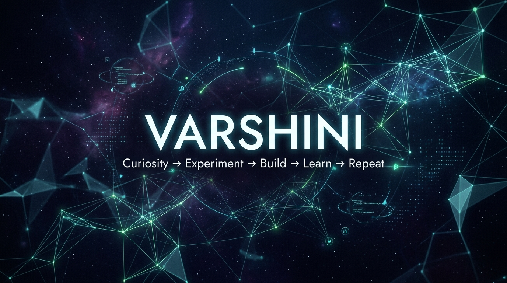

<!--
================================================================================
🌌 MIDNIGHT TECH EXPLORER - PROFILE README
================================================================================
INSTRUCTIONS:
1. Upload the generated 'banner.jpg' (or rename to banner.jpg) to the root of your profile repository.
2. Replace all placeholder links marked with "REPLACE_WITH_..." with your actual URLs.
3. Commit this file as README.md in your repository named 'varshini-thilaga'.
================================================================================
-->

  <!-- GitHub profile banner - resolves locally if banner.jpg is uploaded in the root folder -->
  

<h1 align="center">Hey, I'm Varshini 👋</h1>

  <b>Curious Engineer | AI & Software Developer | Building intelligent systems, scalable applications & experimental technology</b>

  <code>Curiosity → Experiment → Build → Learn → Repeat</code>

### 🧠 The Engineer Behind The Code

Curiosity is my primary engine. I believe the best way to master technology is to build, break, debug, and rebuild. As an Artificial Intelligence & Data Science engineering student, my journey is driven by a constant question: *What happens if I try this?*

I don't just write code; I enjoy designing solutions for real-world scenarios. Whether it's training an NLP model, automating container deployments, or prototyping hardware integrations, I love the messy process of turning abstract ideas into working prototypes. For me, failure is not a setback—it's the telemetry data required to build the next iteration. I approach every project with a builder's heart and an entrepreneurial mindset.

---

### 🚀 What I Build

I love exploring the full spectrum of engineering, from high-level intelligence to low-level automation:
* 🤖 **AI-Powered Applications** — Intelligent systems that solve real-world problems.
* 💻 **Software & Full-Stack Web Apps** — Clean, scalable, and responsive user experiences.
* ☁️ **Cloud-Native Experiments & DevOps** — Infrastructure, Dockerization, and container orchestration.
* 📡 **IoT & Intelligent Hardware** — Bridging physical sensors with software interfaces.
* 🧪 **Technology Experiments & Prototypes** — Rapid validation of ideas and experimental code.

---

### 🛠 Tech Universe

I believe in maintaining a focused, high-utility toolkit. Here are the technologies I actively use and explore:

#### 💻 Programming Languages

  
  
  
  
  

#### 🤖 Artificial Intelligence & Data Science

  
  
  
  
  

#### 🌐 Web Engineering

  
  
  
  
  
  
  

#### 🗄 Databases

  
  
  

#### ☁️ Cloud, DevOps & Developer Tools

  
  
  
  
  
  
  

---

### 🌱 Currently Exploring

I believe that learning is an active, ongoing cycle. Currently, I'm deepening my understanding in:
* **Applied AI Systems**: Scaling NLP and computer vision models beyond local notebooks.
* **DevOps & Cloud-Native Architectures**: Fine-tuning Docker container setups and Kubernetes deployments.
* **System Design Fundamentals**: Understanding load balancing, database scaling, and microservices.
* **Advanced Data Structures & Algorithms**: Optimizing code efficiency and runtime complexity.

---

### 🏆 Featured Projects

Here are the projects that highlight my technical versatility and engineering mindset:

<table>
  <tr>
    <td width="50%" valign="top">
      <h3>🤖 RubbleCrawler</h3>
      
<i>Autonomous disaster rescue robot designed to navigate hazardous environments and collapsed buildings.</i>

      
<b>Core Concepts:</b> Computer Vision, Autonomous Navigation, Sensor Fusion (Thermal & CO₂), Telemetry Dashboard

      

        <a href="<!-- REPLACE_WITH_RUBBLECRAWLER_REPO_URL -->"></a>
        <a href="<!-- REPLACE_WITH_RUBBLECRAWLER_DEMO_URL -->"></a>
      

    </td>
    <td width="50%" valign="top">
      <h3>💬 SECE AI Assistant</h3>
      
<i>An AI-driven multilingual college assistant helping users search and interact with academic data.</i>

      
<b>Core Concepts:</b> Sentence Transformers, NLP, Semantic Search, Voice Integration, Django/React

      

        <a href="<!-- REPLACE_WITH_SECE_ASSISTANT_REPO_URL -->"></a>
      

    </td>
  </tr>
  <tr>
    <td width="50%" valign="top">
      <h3>🦯 Smart Blind Stick</h3>
      
<i>Intelligent assistive device empowering visually impaired users with hazard alerts and emergency systems.</i>

      
<b>Core Concepts:</b> IoT, Arduino, Obstacle Detection (Ultrasonic/IR), SOS Notification

      

        <a href="<!-- REPLACE_WITH_SMART_STICK_REPO_URL -->"></a>
      

    </td>
    <td width="50%" valign="top">
      <h3>🚗 Smart Parking System</h3>
      
<i>A web application built to optimize real-time parking spot reservation and administration.</i>

      
<b>Core Concepts:</b> Web Application Engineering, Database Design, Real-time Allocation

      

        <a href="<!-- REPLACE_WITH_PARKING_SYSTEM_REPO_URL -->"></a>
      

    </td>
  </tr>
  <tr>
    <td width="50%" valign="top">
      <h3>🏥 Healthcare Management Platform</h3>
      
<i>Role-based healthcare administrative system connecting patients, doctors, and system managers.</i>

      
<b>Core Concepts:</b> Authentication, Full-Stack Design, SQL Operations, Secure Portals

      

        <a href="<!-- REPLACE_WITH_HEALTHCARE_PLATFORM_REPO_URL -->"></a>
      

    </td>
    <td width="50%" valign="top">
      <h3>☁️ DevOps / Cloud Learning Lab</h3>
      
<i>Hands-on lab repository documenting configuration, pipelines, and containers.</i>

      
<b>Core Concepts:</b> Linux Shell, Dockerization, Kubernetes, CI/CD Actions

      

        <a href="<!-- REPLACE_WITH_DEVOPS_LAB_REPO_URL -->"></a>
      

    </td>
  </tr>
</table>

---

### 🧪 Experiment Lab

> *"This is where curiosity turns into prototypes."*

I believe a developer shouldn't wait until they are an expert to start building. Here are small prototypes, automation scripts, and proof-of-concepts where I learn by coding:
* **Computer Vision Playground** — Script testing edge detection and basic facial recognition.
* **Infrastructure Hacks** — Docker Compose files testing network routing configurations.
* **Automation Scripts** — Python scripts automating repetitive file formatting.
* *Explore the latest experiments in my* [🧪 Experiment Repository](<!-- REPLACE_WITH_EXPERIMENTS_REPO_URL -->).

---

### 💻 Problem Solving & Coding Journey

I actively work on sharpening my algorithmic thinking and computer science fundamentals:
* **Problem Solving**: Structuring clean solutions to algorithmic challenges.
* **DSA Focus**: Deepening memory allocation, tree traversals, and graph search paradigms.

  <a href="<!-- REPLACE_WITH_LEETCODE_URL -->"></a>
  <a href="<!-- REPLACE_WITH_DSA_REPO_URL -->"></a>

---

### 🏅 Milestones & Achievements

* **ICPC Asia West Regional**: Selected and competed, solving algorithmic problems under pressure.
* **VIT Hackathon Finalist**: Reached the final round with a prototype designed in 24 hours.
* **NIELIT Internship**: Gained practical understanding of institutional technical infrastructure.
* **NPTEL Certification**: Successfully completed the *Programming in Java* certification.
* **Continuous Upskilling**: Certified in AI fundamentals and Full-Stack development essentials.

---

### 🎯 Where I'm Heading

I'm focused on the intersection of **Intelligent Systems, Software Engineering, and Scalable Products**. My long-term goal is to bridge the gap between AI models and cloud-native software products, building platforms that are not only intelligent but resilient and highly user-centric.

---

### 📊 Git Analytics

  
   
  

---

### 🤝 Connect with Me

Let's collaborate on building something meaningful:

  <a href="<!-- REPLACE_WITH_LINKEDIN_URL -->"></a>
  <a href="<!-- REPLACE_WITH_PORTFOLIO_URL -->"></a>
  <a href="mailto:<!-- REPLACE_WITH_EMAIL_ADDRESS -->"></a>

